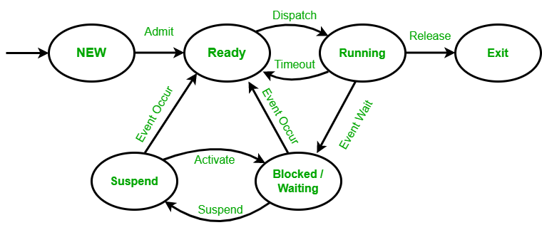

## Day 2 – Terminal, OS & Developer Environment

### Topics
- Terminal fundamentals and Linux basics
- File and folder operations
- Process and port management
- Environment variables and PATH
- Package managers (pip, npm)
- Git fundamentals and version control

### Common Commands
```bash
pwd
ls -la
cd
mkdir
touch
rm
rm -rf
ps aux
kill -9 PID
lsof -i :3000
git init
git add .
git commit -m "message"
```

### Outcome
- Comfortable working entirely from terminal

---


**Linux Commands**

1. ls  , list all directories in current folder
    ls [options] [directory_or_path]

    - ls
    - ls -Ra /path/to/dir     # -R is seeing subfolders also, -a is for seeing hidden contect also
    ls -l   , show all with extra info
    ls -a   , show hidden files also
    ls -la  , show hidden files also with full details


2. pwd [options]
    - pwd -P  , # -P outputs the exact location,
    - pwd -L  , # -L option prints environment variable content, like shortcuts, instead of the actual path

    After this the -P and -L will give the difference
        ln -s TARGET LINK_NAME
        TARGET → the real file or directory

        LINK_NAME → the symlink (shortcut)

3. cd [path_or_directory]
    cd ..       one directories back
    cd ../../   two directories backward
    cd   returns to the current user’s home directory.
    cd -  , return to previous directory you have come from in terminal
    cd ../folder_name/  -> you can alos nest them to make fast moves


4. mkdir [options] directory_name1 directory_name2

    mkdir dir_name1 dir_name2
    mkdir path/to/target_folder/new_folder    ,to create new_folder in /path/to/target_folder:

    mkdir -p folder/subfolder/morefolder    , to make nested folders


5. rmdir folder-name     , removes this directory
    rmdir -p folder-name  , remove this directory + its sub directories


6.  rm file1 file2   , to remove the file
    rm -r myfolder    , recursively remove all the sub files and folders also
    rm -i file      , it give you intractive option before deleting it
    rm -ri myfolder   , Asks for confirmation before each deletion
    rm -rf myfolder ,  means it will delete the protected files also like the pdf file.

    -r → remove folders + subfolders
    -i → ask before deleting
    -f → delete without asking   , means it will delete the protected files also like the pdf file
    rm -rf → powerful and dangerous       

7. cp file1 file2 [target_path]
    cp file1 file2                  , file1 will be copied in file2, if file2 is not there it will be creted 

    cp source_file /path/to/target_file   , its also possible
    cp -R /path/to/folder /target/path/to/folder_copy     ,copy the one folder into another as specified by the path


8.  cat file_name     , to see the content of the file
    cat file1 >> file2    , it will append the file1 into the file2

9.  mv file_name target_path_directory     , it will move the file into the specified directory
    mv old_name new_name   , its will rename the file
    mv /original/path/file1.txt the/target/path

10. nano/vi/jed file_name     , to edit in the file


**Process handling Commands**
1. *ps aux*    , process status, current running processes
2. kill PID    ,gracefull stop
3. *kill -9 PID*     ,Forcefully stops a process.
4. pkill name_of_process   , to kill process by name


Breakdown:
kill → command to stop a process
-9 → SIGKILL, the most forceful kill signal (cannot be ignored)
PID → process ID of the process to kill (from ps aux or other tools)


5. lsof -i :3000   - Shows which process is using network port 3000.
    lsof → list open files (everything in Linux is a file: network connections,devices, all is the file)
    -i :3000 → filter to internet/network connections on port 3000


*Graceful shutdown = polite, safe exit*
*Forceful kill = immediate, can cause problems*

SUDO   -> Super User DO   ,you will be having a super authority to do what previously you were not


Process is every running instance of a program.
like node.js server

**Processes transition through states during execution:**
New – The process is being created.
Ready – Waiting to be assigned to the CPU.
Running – Currently executing on the CPU.
Waiting (Blocked) – Waiting for an event (e.g., I/O completion).
Terminated – Finished execution.




**Port management**
Port management is the process of monitoring, controlling, and allocating network ports on a computer or server.
A port is a logical endpoint used by a process to communicate over a network (TCP or UDP).

Port management ensures that:

Ports are used efficiently.
No port conflicts occur.
Network traffic reaches the correct process.
Security policies regarding ports are enforced.

A port is a logical communication endpoint used by a computer to send or receive data over a network.

The house = your computer (IP address)
The door = port (numbered 0–65535)
The entering/leaving = network traffic (data packets)

Without ports, your computer wouldn’t know which application should handle incoming data.

**Port Types**
1. Well-known ports (0–1023): Reserved for standard services (HTTP, FTP, SSH).
2. Registered ports (1024–49151): Assigned to user processes or applications.
3. Dynamic/Private ports (49152–65535): Temporary ports assigned for client connections.

ps – list processes
top / htop – real-time process monitor
kill <PID> – terminate a process
netstat -tuln – list open ports
netstat -ano – list all connections and PID

**Example:**
HTTP uses port 80 (TCP)
HTTPS uses port 443 (TCP)
FTP -> TCP port 21
DNS uses port 53 (UDP/TCP)


**Relationship Between Processes and Ports**
Processes use ports to communicate over the network.
Each network-based process binds to a port number.
Only one process can bind to a specific port on a specific IP at a time.


**Enviroment variables and paths**
Environment variables are named values storing system/user settings, while the PATH is a crucial environment variable listing directories where the OS searches for executable programs, letting you run commands from any location without typing the full path, e.g., typing python instead of /usr/bin/python. Modifying PATH (adding directories separated by colons on Linux/macOS or semicolons on Windows) makes newly installed tools instantly accessible from the command line after restarting your terminal.


**Package Manager**
A package manager is a tool that automates the process of installing, updating, configuring, and removing software packages for a programming language or system.
2. What is pip?

pip stands for “Pip Installs Packages”. It is the default package manager for Python.

*Main Features of pip:*

Installs packages from PyPI (Python Package Index).
Manages package versions.
Handles dependencies automatically.
Can install packages locally (per project) or globally.

**Common pip Commands**
Command	Purpose
pip install <package>	            Install a package
pip install <package>==1.2.3	    Install a specific version
pip install "package_name>=1.20,<2.0"   install range

pip uninstall <package>	            Remove a package
pip list	                        List installed packages
pip freeze	                        Output installed packages with exact versions (useful for requirements.txt)
pip install -r requirements.txt	                Install all packages listed in a file
pip install --upgrade package_name              to upgrade to the latest version
pip install --upgrade package_name==version     to install a specific version
pip install --upgrade package_name --no-deps    update without updating dependencies

**What is npm?**

npm stands for “Node Package Manager”. It is the default package manager for Node.js (JavaScript runtime).

*Main Features of npm:*

Installs packages from the npm registry (online repository for JavaScript packages).
Manages dependencies and versioning.
Can install packages globally or locally (per project).
Provides scripts to automate tasks.


Common npm Commands
Command	Purpose
npm install <package>	    it will install a package locally in node_modules
npm install -g <package>	Install a package globally
npm uninstall <package>	    remove a package
npm update	                Update packages
npm list	                List All packages (also downloaded not installed)
npm init	                Create a new project with package.json
npm install	                Install all dependencies listed in package.json
pip show package_name       list installed packages
pip list --outdated         List Outdated Packages


**Creating the python virtual enviroment**

python -m venv venv    , Create Virtual Environment
venv\Scripts\activate    , to activate the virtual enviroment
source venv/bin/activate   , in the linux we need to do this
